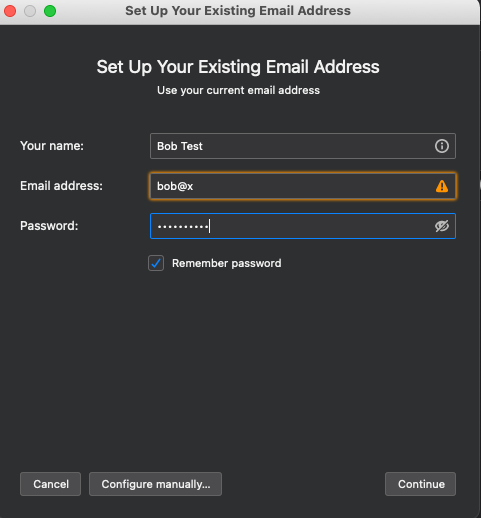

# Ubikom Project
*Encrypted email service based on decentralized private identity.*

## The Project

With Ubikom project, you can communicate via email in a secure way, while using the existing email clients that you know and love.

All email within Ubikom ecosystem is encrypted and authenticated.

There are no accounts. You create and register your private key, your possession of the private key is your identity.

You can run your own server, or you can interact with the public server. If you chose the latter, you temporary delegate the authority
to send and receive mail to the public proxy server. This delegation can be revoked at any time using your main private key.

You are also able to interact with the legacy email world using our gateway (coming up later).

## Getting the Binaries

As of now, you must run a few commands on your machine to generate the keys in a secure way. 

You can get binaries by compiling the source, or by pulling the pre-built binaries. The former is recommended, since you can examine the code to make sure no funny business is taking place. 

To compile the source, you must have Go and make installed.

To clone the repo, do:

```
git clone github.com/regnull/ubikom
```

Now build the binaries:

```
cd ubikom
make build
```

The binaries are placed in build directory, corresponding to your system (linux, windows or mac).

If you like to live dangerously, you can get the pre-build binaries by downloading the latest release from GitHub releases page.

## Getting Started

The easiest way to get started is to use our easy setup binary. When you run it, the following things will happen:

* The main private key is generated and saved under $HOME/.ubikom/key
* The additional key is generated and saved under $HOME/.ubikom/email.key
* The email key is registered as a child of the main key. This means that the email key has limited authorization, to send and receive mail only. The main key can disable it at any time.
* Your chosen name is registered with the identity service
* The public proxy service is registered as the place where you receive your email

So, let's go ahead and run the setup binary. It will prompt you for the name you would like to use, and password for the email key.

Your name is what other users will use to send you email. Think of it as joe in joe@gmail.com - only without "@gmail.com" part. Your identity does not
belong to any server, or domain. It belongs to you.

```
$ ./easy-setup
Enter the name you would like to use: bob
Enter new password: pumpkin123
16:29:40 DBG generating POW...
16:29:40 DBG POW found pow=571112bedeebe56f
16:29:41 INF main key is registered
16:29:41 DBG generating POW...
16:29:44 DBG POW found pow=1b2340cbaadd9630
16:29:44 INF email key is registered
16:29:44 DBG generating POW...
16:29:47 DBG POW found pow=6da1ab414fbed96b
16:29:47 INF key relationship is updated
16:29:47 DBG generating POW...
16:29:49 DBG POW found pow=43600cb932e19d40
16:29:49 INF name is registered
16:29:49 DBG generating POW...
16:29:52 DBG POW found pow=4e1d0e883508751e
16:29:52 INF address is registered

Use the following information in your email client:
User name: 78spGfDTj5s
Password: pumpkin123
POP and SMTP server address: alpha.ubikom.cc
```

It might take a few seconds - while registering keys, names, and addresses, the clients are required to compute Proof-of-Work for every request, to reduce spam and name squatting. 

Notice the information printed at the end, you will need it to configure your email client.

## Configure Your Email Client

Let's use [Mozilla Thunderbird](https://www.thunderbird.net/en-US/) as an example, other email clients can be configured in a similar way.

Open Thunderbird and add new account:



## Testing the prototype

But enough talk, let's see how the prototype works. Before we do this, here's a necessary disclaimer:

**This is a prototype. It's not production-ready yet. Use it at your own risk. Things are likely to change in future, which includes changes breaking current functionality. The database can also be reset, wiping out whatever names you have registered.**

And another thing - in this example, we will use the public identity, dump, and proxy servers, but nothing prevents you from running your own (it's just another binary), so you will have your own private email system, where you and your buddies can exchange completely private messages. Not bad, huh? Just provide the new URL to the commands you run, and off you go. 

The procedure below describes the easiest way to set up your email - it involves delegating some authority to a public email proxy which will decrypt your emails for you.

### Step 1: Get the binaries

You can get binaries by compiling the source, or by pulling the pre-built binaries. The former is recommended, since you can examine the code to make sure no funny business is taking place. 

To compile the source, you must have Go and make installed.

To clone the repo, do:

```
git clone github.com/regnull/ubikom
```

Now build the binaries:

```
cd ubikom
make build
```

The binaries are placed in build directory, corresponding to your system (linux, windows or mac).

If you like to live dangerously, you can get the pre-build binaries by downloading the latest release from GitHub releases page.

### Step 2: Open the terminal and go to the directory where your binaries are located

For example, for Linux it would be (cloned repo location)/build/linux-amd64.

Go there, or add this directory to the path or whatever. 

### Step 3: Create and register your main key
To generate your private key, run the following command:

```
./ubikom-cli create key
```

This will create a new key and save it under $HOME/.ubikom/key

Now, register the key:

```
./ubikom-cli register key
```

### Step 4: Create and register a child key

Because we want to use public email proxy to do encryption for us, we must create a child key that will be used to encrypt and sign emails.

This key will be sent to the proxy as user name/password pair, and the proxy will not store it beyond the current user session.

Again, the system doesn't have to be set up this way (you can run the proxy yourself if you prefer more security vs. convenience).

Bear in mind that the child key cannot be used for anything beyond encryption and signing - for example, it can't be used to change the registered
name or address. This is what your parent key for. In an event where your child key becomes compromised, the parent key can be used
to switch the name to another key and disable the compromised key.

So, let's go ahead and create the child key. To do that, we will have to specify a password:

```
./ubikom-cli create key --out=child.key --from-password=pumpkin123
```

Write down the salt value, you will need it later.

Now, register the child key:

```
./ubikom-cli register key --key=child.key
```

Establish the parent-child relationship between the keys:

```
./ubikom-cli register child-key --child=child.key
```

### Step 6: Reserve your name
Name is what you use to send and receive messages. You must associate your name with your private key. The name must be unique - so if you get an error, try another name:

```
./ubikom-cli register name bob --target=child.key
```

### Step 6: Specify your address
This is where your messages are being sent. The dump server only handles the encrypted messages. You can either run your own dump server, or use the public one, here:

```
./ubikom-cli register address bob alpha.ubikom.cc:8826 --target=child.key
```

Seriously, don't use bob with the public server. Bob is already registered. 

### Step 7: Configure your email client

For this example, we will use the public proxy service because it makes things easy. 

I use [Mozilla Thunderbird](https://www.thunderbird.net/en-US/) for testing. It's great, and it's available for multiple platforms. Other might also work, so go ahead and try. 

Configure your email client as follows:

* Your email is "name@x", where name is the name you've registered in Step 5, and the rest is, yes, symbol @ and the letter x.
* Set your incoming mail server to POP3, localhost, port 1100
* Set your outgoing mail server to SMTP, localhost, port 1025
* For both POP and SMTP servers, the default name is "ubikom-user" and the password is "pumpkin123". Change it in ubikom.conf file, if you feel like it.

### Step 9: Use your mail client
Send secure email to other users, addressing it to name@x. 
Heck, send email to me, lgx@x! Definitely report bugs. 

## Current status

* Messages are encrypted and signed, which means only the intended recipient can read messages addressed to them.
* Sender and recipient names are not encrypted, so theoretically someone may find out that Bob sent message to Alice, but that's about it. You can't really do anything with names, since we must know who sent the message (to verify the signature), and who the recipient is.
* Eventually the identity service will be distributed and decentralized, but for now it's just a single machine.
* All messages are being sent via the big dump service, where they sit just as a bunch of bytes. You can run your own dump server (and identity server) instead.

## Work in progress

* Ability to use mail client without running proxy locally
* Key hierarchy - parent keys can cancel child keys and do anything else the child keys can do
