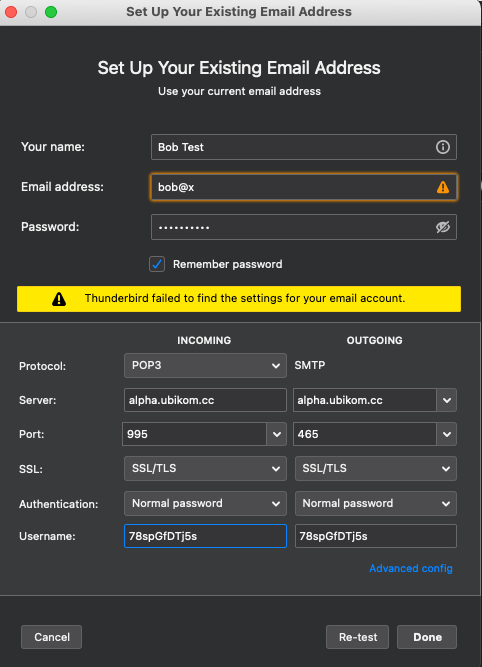

# Ubikom Project
*Encrypted email service based on decentralized private identity.*

## The Project

With Ubikom project, you can communicate via email in a secure way, while using the existing email clients that you know and love.

All email within Ubikom ecosystem is encrypted and authenticated.

There are no accounts. You create and register your private key, your possession of the private key is your identity.

You can run your own server, or you can interact with the public server. If you chose the latter, you temporary delegate the authority
to send and receive mail to the public proxy server. This delegation can be revoked at any time using your main private key.

You are also able to interact with the legacy email world using our gateway (coming up later).

## Why?

Long ago, you were able to run your own email server, which gave you an easy way to communicate with the world. Now you have to use Google or Microsoft for the simple task of sending messages to each other. Your identity is controlled by those companies, not by you. We want to give the identity back to the user and make it decentralized and not controlled by any entity. Based on this, we want to re-imagine email which is secure, private, and simple. It should be trivial for everyone (and everything) to register a name and start communicating.

## Getting the Binaries

As of now, you must run a few commands on your machine to generate the keys in a secure way. 

You can get binaries by compiling the source, or by pulling the pre-built binaries. The former is recommended, since you can examine the code to make sure no funny business is taking place. 

To compile the source, you must have Go and make installed.

To clone the repo, do:

```
git clone github.com/regnull/ubikom
```

Now build the binaries:

```
cd ubikom
make build
```

The binaries are placed in build directory, corresponding to your system (linux, windows or mac).

If you like to live dangerously, you can get the pre-build binaries by downloading the latest release from GitHub releases page.

## Getting Started

The easiest way to get started is to use our easy setup binary. When you run it, the following things will happen:

* The main private key is generated and saved under $HOME/.ubikom/key
* The additional key is generated and saved under $HOME/.ubikom/email.key
* The email key is registered as a child of the main key. This means that the email key has limited authorization, to send and receive mail only. The main key can disable it at any time.
* Your chosen name is registered with the identity service
* The public proxy service is registered as the place where you receive your email

So, let's go ahead and run the setup binary. It will prompt you for the name you would like to use, and password for the email key.

Your name is what other users will use to send you email. Think of it as joe in `bob@gmail.com` - only without "@gmail.com" part. Your identity does not
belong to any server, or domain. It belongs to you.

```
$ ./easy-setup
Enter the name you would like to use: bob
Enter new password: pumpkin123
16:29:40 DBG generating POW...
16:29:40 DBG POW found pow=571112bedeebe56f
16:29:41 INF main key is registered
16:29:41 DBG generating POW...
16:29:44 DBG POW found pow=1b2340cbaadd9630
16:29:44 INF email key is registered
16:29:44 DBG generating POW...
16:29:47 DBG POW found pow=6da1ab414fbed96b
16:29:47 INF key relationship is updated
16:29:47 DBG generating POW...
16:29:49 DBG POW found pow=43600cb932e19d40
16:29:49 INF name is registered
16:29:49 DBG generating POW...
16:29:52 DBG POW found pow=4e1d0e883508751e
16:29:52 INF address is registered

Use the following information in your email client:
User name: 78spGfDTj5s
Password: pumpkin123
POP and SMTP server address: alpha.ubikom.cc
```

It might take a few seconds - while registering keys, names, and addresses, the clients are required to compute Proof-of-Work for every request, to reduce spam and name squatting. 

Notice the information printed at the end, you will need it to configure your email client.

## Configure Your Email Client

Let's use [Mozilla Thunderbird](https://www.thunderbird.net/en-US/) as an example, other email clients can be configured in a similar way.

Open Thunderbird and add new account:


Your name is whatever you choose. 

Email address is bob@x. Remember, we don't want "@whatever" part, but the client expects it - so we put "@x" as a shortcut. Some stickler clients might not like it either, so you can also use `bob@ubikom.cc` format.

The password is what you entered as a password when running easy-setup, in our case, pumpkin123.

Click "Continue". You will be presented with the next dialog:




Under INCOMING, enter the following:

* "POP3" for protocol
* "alpha.ubikom.cc" for server
* "995" for port (the default)
* "SSL/TLS" for SSL
* "Normal password" for authentication
* The user name printed by the simple-setup as username, in our case it's "78spGfDTj5s"

Under OUTGOING, enter the following:

* "alpha.ubikom.cc" for server
* "465" for port (the default)
* "SSL/TLS" for SSL
* "Normal password" for authentication
* The user name printed by the simple-setup as username, in our case it's "78spGfDTj5s"

Click "Done".

Send a message to yourself (bob@x) to make sure everything works. You will be prompted for your password, enter the password you used when running easy-setup (in our case, pumpkin123).

## Work in Progress

* Generate keys via the web interface (but user will always have an option to generate the keys locally)
* Email gateway
* Decentralize the identity service
